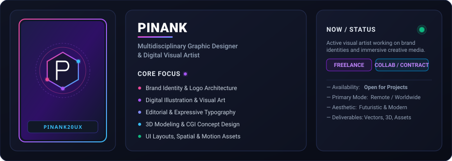
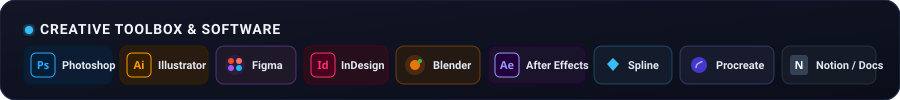
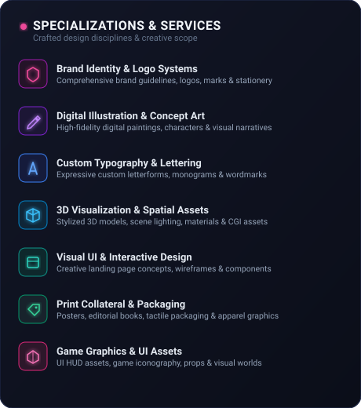
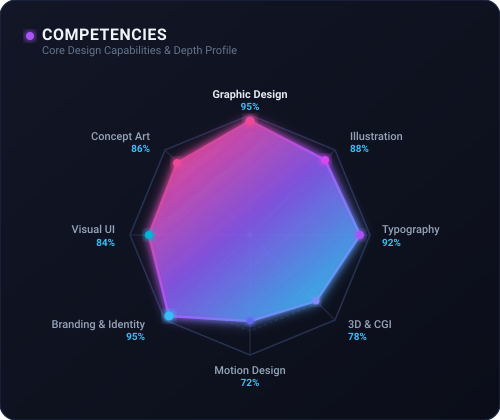
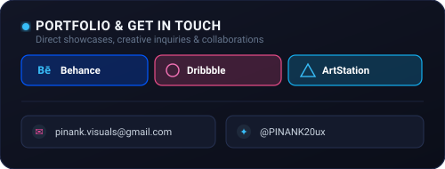
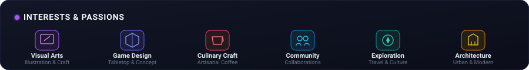

<!-- ======================= HEADER SECTION ======================= -->

 

<!-- ======================= SOUNDWAVE DIVIDER ======================= -->

 

<!-- ======================= TOOLBOX / STACK ======================= -->

 

<!-- ======================= DASHBOARD GRID ======================= -->
<table border="0" cellpadding="0" cellspacing="0" width="100%">
  <tr>
    <td width="49%" valign="top">
      
    </td>
    <td width="2%"></td>
    <td width="49%" valign="top">
      
        
      
    </td>
  </tr>
</table>

 

<!-- ======================= INTERESTS & PASSIONS ======================= -->

 

<!-- ======================= LIVE GITHUB STATS ======================= -->
<table border="0" cellpadding="0" cellspacing="0" width="100%">
  <tr>
    <td width="49%" align="center" valign="middle">
      
    </td>
    <td width="2%"></td>
    <td width="49%" align="center" valign="middle">
      
    </td>
  </tr>
</table>

 

<!-- ======================= QUICK CONNECT BADGES ======================= -->

  
  &nbsp;
  
  &nbsp;
  
  &nbsp;
  
  &nbsp;
  

Crafted with precision • Dark Cyberpunk Aesthetic • © 2026 PINANK20ux

